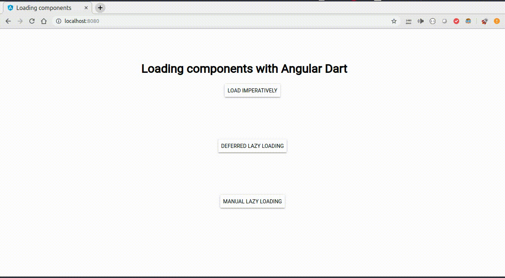

# Loading components with Angular Dart

 Play a little bit with different options to load angular dart components dinamically.

## Screenshots
 
  
 
 ## Install
* Git clone https://github.com/samuelzv/loading-angulardart-components
* cd loading-angulardart-components
* pub get
* webdev serve
 
 ## Reference:
 https://webdev.dartlang.org/angular/note/faq/component-loading

